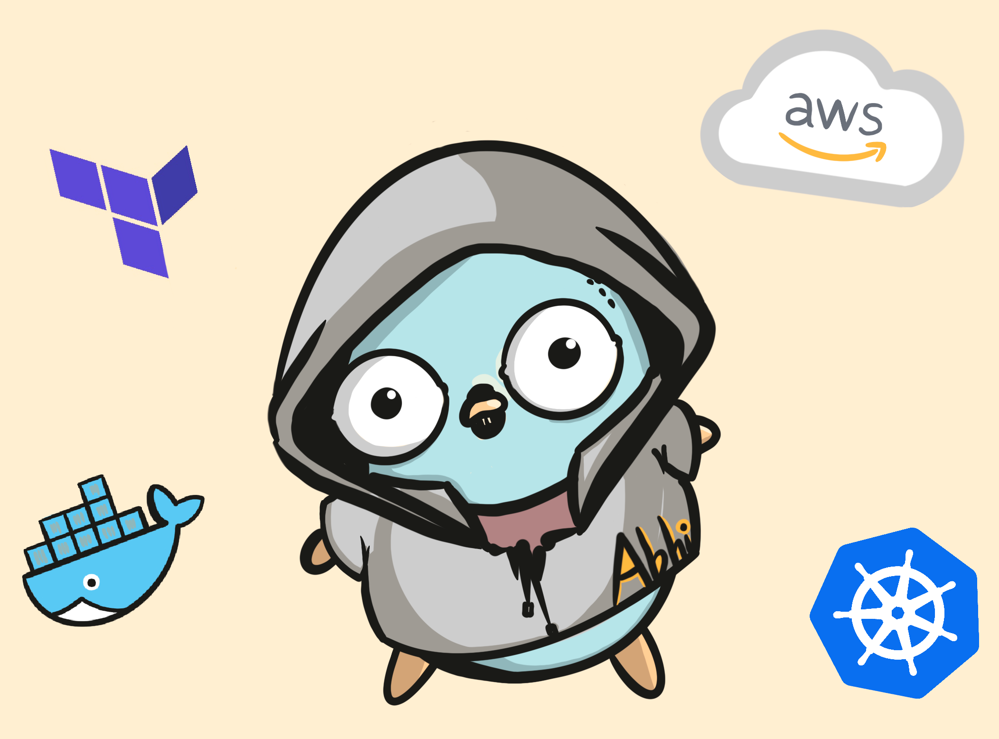

<h2> Hi, I'm Abhi!</h2>

<em>Lead Software Engineer at <a href="https://www.onerahealth.com/">Onera Health(Medical Startup).</a>
  
I enjoy designing and building cloud native software solutions. 

**Daily Tech Stack**

**Development Environment**

* OS: Ubuntu Focal Fossa, WSL2(for prototyping)
* Editor: VS Code, Typora(Markdown)
* Terminal: Terminator

I use Github to host my hobby projects(mostly private for the moment).

   

**Social Media**
* 
* 
* 
